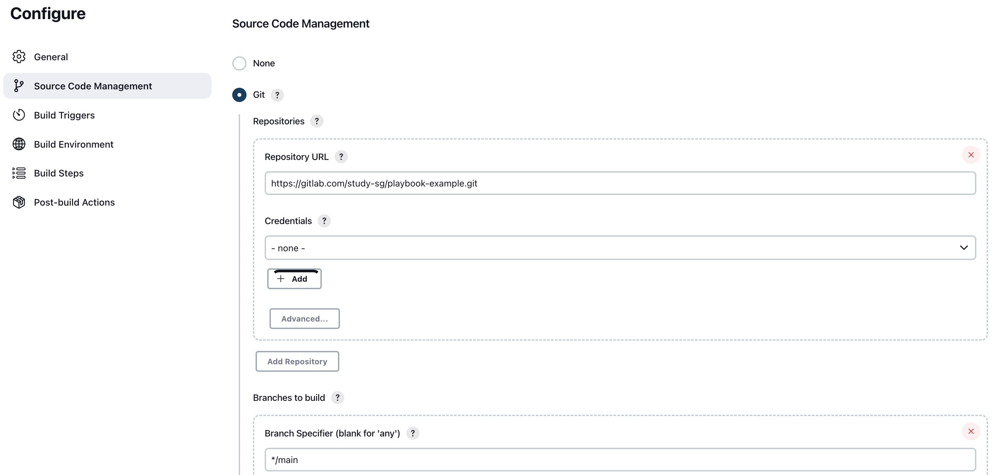
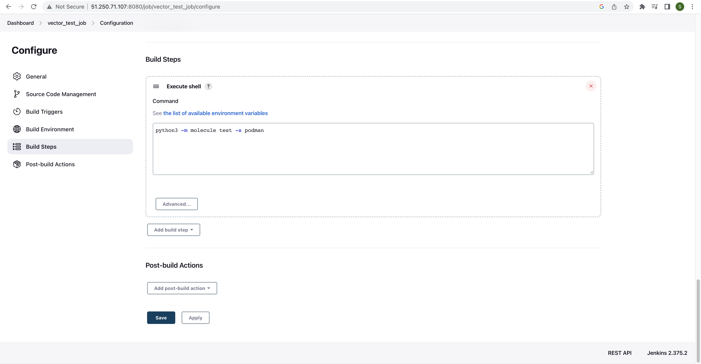
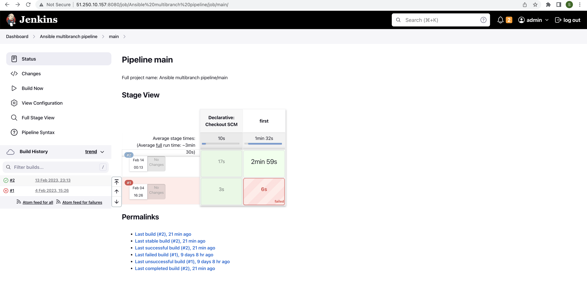

# Домашнее задание к занятию "10.Jenkins"

## Подготовка к выполнению

1. Создать 2 VM: для jenkins-master и jenkins-agent.
2. Установить jenkins при помощи playbook'a.
3. Запустить и проверить работоспособность.
4. Сделать первоначальную настройку.

## Основная часть

1. Сделать Freestyle Job, который будет запускать `molecule test` из любого вашего репозитория с ролью.

#### Ответ

Выполнено:

<details>
    <summary>Git исходник задачи</summary>
    
</details>

<details>
    <summary>Freestyle job</summary>
    
</details>

<details>
<summary>Содержание файла requirements.yml</summary>

```yml
---
  - src: https://gitlab.com/study-sg/vector-role.git
    scm: git
    version: "1.3.0"
    name: vector
```

</details>

---

2. Сделать Declarative Pipeline Job, который будет запускать `molecule test` из любого вашего репозитория с ролью.
3. Перенести Declarative Pipeline в репозиторий в файл `Jenkinsfile`.

#### Ответ

Pipeline перенесен в JenkinsFile в репозиторий:\
<https://gitlab.com/study-sg/playbook-example/-/blob/main/Jenkinsfile>

---

4. Создать Multibranch Pipeline на запуск `Jenkinsfile` из репозитория.

#### Ответ

Multibranch pipeline создан, но не работает.

<details>
    <summary>Multibranch pipeline error</summary>
    
</details>

---

5. Создать Scripted Pipeline, наполнить его скриптом из [pipeline](./pipeline).
6. Внести необходимые изменения, чтобы Pipeline запускал `ansible-playbook` без флагов `--check --diff`, если не установлен параметр при запуске джобы (prod_run = True), по умолчанию параметр 
имеет значение False и запускает прогон с флагами `--check --diff`.

#### Ответ

```groovy
node("ansible"){
    stage("Git checkout"){
        git credentialsId: '91f90be2-44a4-4f4c-84dd-0a6209f7edf1', url: 'https://gitlab.com/study-sg/lighthouse-role.git'
    }
    stage("Sample define secret_check"){
        secret_check=true
    }
    stage("Run playbook"){
        if (secret_check){
            if (run_prod){
                sh 'ansible-playbook site.yml -i inventory/prod.yml'
            }
            else{
                sh 'ansible-playbook site.yml -i inventory/prod.yml --diff --check'
            }
        }
        else{
            echo 'need more action'
        }
    }
}
```

---

7. Проверить работоспособность, исправить ошибки, исправленный Pipeline вложить в репозиторий в файл `ScriptedJenkinsfile`.
8. Отправить ссылку на репозиторий с ролью и Declarative Pipeline и Scripted Pipeline.

## Необязательная часть

1. Создать скрипт на groovy, который будет собирать все Job, которые завершились хотя бы раз неуспешно. Добавить скрипт в репозиторий с решением с названием `AllJobFailure.groovy`.
2. Создать Scripted Pipeline таким образом, чтобы он мог сначала запустить через Ya.Cloud CLI необходимое количество инстансов, прописать их в инвентори плейбука и после этого запускать 
плейбук. Тем самым, мы должны по нажатию кнопки получить готовую к использованию систему.

---

### Как оформить ДЗ?

Выполненное домашнее задание пришлите ссылкой на .md-файл в вашем репозитории.

---
