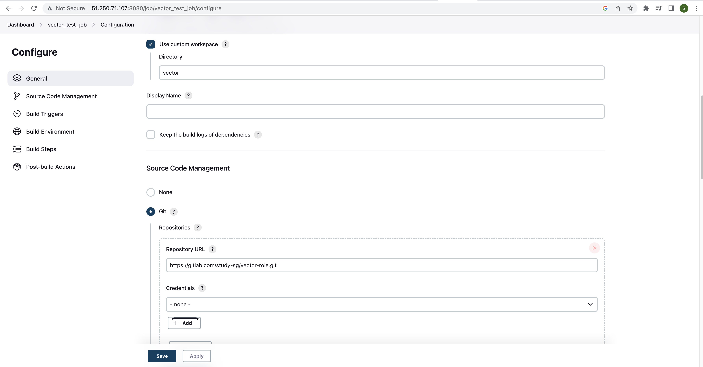

# Домашнее задание к занятию "10.Jenkins"

## Подготовка к выполнению

1. Создать 2 VM: для jenkins-master и jenkins-agent.
2. Установить jenkins при помощи playbook'a.
3. Запустить и проверить работоспособность.
4. Сделать первоначальную настройку.

## Основная часть

1. Сделать Freestyle Job, который будет запускать `molecule test` из любого вашего репозитория с ролью.

#### Ответ

Выполнено:

<details>
    <summary>Git исходник задачи</summary>
    
</details>

<details>
    <summary>Freestyle job</summary>
    
</details>

<details>
<summary>Содержание файла requirements.yml</summary>

```yml
---
  - src: https://gitlab.com/study-sg/vector-role.git
    scm: git
    version: "1.3.0"
    name: vector
```

</details>

---

2. Сделать Declarative Pipeline Job, который будет запускать `molecule test` из любого вашего репозитория с ролью.
3. Перенести Declarative Pipeline в репозиторий в файл `Jenkinsfile`.

#### Ответ

Pipeline перенесен в JenkinsFile в репозиторий:\
<https://gitlab.com/study-sg/playbook-example/-/blob/main/Jenkinsfile>


Pipeline не работает:

<details>
<summary>Содержание лога</summary>

```
Started by user admin
Obtained Jenkinsfile from git https://github.com/Vainoord/net_devops_repo01.git
[Pipeline] Start of Pipeline
[Pipeline] node
Running on clt-01 in /opt/jenkins_agent/workspace/Ansible pipeline
[Pipeline] {
[Pipeline] stage
[Pipeline] { (Declarative: Checkout SCM)
[Pipeline] checkout
Selected Git installation does not exist. Using Default
The recommended git tool is: NONE
No credentials specified
Fetching changes from the remote Git repository
Checking out Revision e76daa1679fee7d1dd0ebf4be02a59ba2e4200ea (refs/remotes/origin/main)
Commit message: "flush repository"
 > git rev-parse --resolve-git-dir /opt/jenkins_agent/workspace/Ansible pipeline/.git # timeout=10
 > git config remote.origin.url https://github.com/Vainoord/net_devops_repo01.git # timeout=10
Fetching upstream changes from https://github.com/Vainoord/net_devops_repo01.git
 > git --version # timeout=10
 > git --version # 'git version 2.31.1'
 > git fetch --tags --force --progress -- https://github.com/Vainoord/net_devops_repo01.git +refs/heads/*:refs/remotes/origin/* # timeout=10
 > git rev-parse refs/remotes/origin/main^{commit} # timeout=10
 > git config core.sparsecheckout # timeout=10
 > git checkout -f e76daa1679fee7d1dd0ebf4be02a59ba2e4200ea # timeout=10
 > git rev-list --no-walk e76daa1679fee7d1dd0ebf4be02a59ba2e4200ea # timeout=10
[Pipeline] }
[Pipeline] // stage
[Pipeline] withEnv
[Pipeline] {
[Pipeline] stage
[Pipeline] { (first)
[Pipeline] sh
+ ansible-galaxy install -r requirements.yml -p .
[WARNING]: - vector was NOT installed successfully: - command /usr/bin/git
clone git@gitlab.com:study-sg/vector-role.git vector failed in directory
/home/jenkins/.ansible/tmp/ansible-local-4460jalem75m/tmpifob6hdd (rc=128) -
Cloning into 'vector'... git@gitlab.com: Permission denied (publickey).  fatal:
Could not read from remote repository.  Please make sure you have the correct
access rights and the repository exists.
ERROR! - you can use --ignore-errors to skip failed roles and finish processing the list.
Starting galaxy role install process
[Pipeline] }
[Pipeline] // stage
[Pipeline] }
[Pipeline] // withEnv
[Pipeline] }
[Pipeline] // node
[Pipeline] End of Pipeline
ERROR: script returned exit code 1
Finished: FAILURE
```

</details>

---

4. Создать Multibranch Pipeline на запуск `Jenkinsfile` из репозитория.

#### Ответ

Multibranch pipeline создан, но не работает.

<details>
    <summary>Multibranch pipeline error</summary>
    
</details>

---

5. Создать Scripted Pipeline, наполнить его скриптом из [pipeline](./pipeline).
6. Внести необходимые изменения, чтобы Pipeline запускал `ansible-playbook` без флагов `--check --diff`, если не установлен параметр при запуске джобы (prod_run = True), по умолчанию параметр 
имеет значение False и запускает прогон с флагами `--check --diff`.

#### Ответ

<details>
<summary>Скрипт pipeline</summary>

```groovy
node("ansible"){
    stage("Git checkout"){
        git credentialsId: '91f90be2-44a4-4f4c-84dd-0a6209f7edf1', url: 'https://gitlab.com/study-sg/lighthouse-role.git'
    }
    stage("Sample define secret_check"){
        secret_check=true
    }
    stage("Run playbook"){
        if (secret_check){
            if (run_prod){
                sh 'ansible-playbook site.yml -i inventory/prod.yml'
            }
            else{
                sh 'ansible-playbook site.yml -i inventory/prod.yml --diff --check'
            }
        }
        else{
            echo 'need more action'
        }
    }
}
```

</details>

Pipeline не запускается:

<details>
<summary>Лог pipeline</summary>

```
Started by user admin
[Pipeline] Start of Pipeline
[Pipeline] node
Running on clt-01 in /opt/jenkins_agent/workspace/Scripted pipeline
[Pipeline] {
[Pipeline] stage
[Pipeline] { (Git checkout)
[Pipeline] git
The recommended git tool is: NONE
using credential 91f90be2-44a4-4f4c-84dd-0a6209f7edf1
Fetching changes from the remote Git repository
[Pipeline] }
[Pipeline] // stage
[Pipeline] }
[Pipeline] // node
 > git rev-parse --resolve-git-dir /opt/jenkins_agent/workspace/Scripted pipeline/.git # timeout=10
 > git config remote.origin.url https://gitlab.com/study-sg/lighthouse-role.git # timeout=10
Fetching upstream changes from https://gitlab.com/study-sg/lighthouse-role.git
 > git --version # timeout=10
 > git --version # 'git version 2.31.1'
using GIT_SSH to set credentials 
[INFO] Currently running in a labeled security context
[INFO] Currently SELinux is 'enforcing' on the host
 > /usr/bin/chcon --type=ssh_home_t /opt/jenkins_agent/workspace/Scripted pipeline@tmp/jenkins-gitclient-ssh2118046113282205165.key
Verifying host key using known hosts file
 > git fetch --tags --force --progress -- https://gitlab.com/study-sg/lighthouse-role.git +refs/heads/*:refs/remotes/origin/* # timeout=10
 > git rev-parse refs/remotes/origin/master^{commit} # timeout=10
 > git rev-parse origin/master^{commit} # timeout=10
[Pipeline] End of Pipeline
ERROR: Couldn't find any revision to build. Verify the repository and branch configuration for this job.
Finished: FAILURE
```

</details>

---

7. Проверить работоспособность, исправить ошибки, исправленный Pipeline вложить в репозиторий в файл `ScriptedJenkinsfile`.
8. Отправить ссылку на репозиторий с ролью и Declarative Pipeline и Scripted Pipeline.

## Необязательная часть

1. Создать скрипт на groovy, который будет собирать все Job, которые завершились хотя бы раз неуспешно. Добавить скрипт в репозиторий с решением с названием `AllJobFailure.groovy`.
2. Создать Scripted Pipeline таким образом, чтобы он мог сначала запустить через Ya.Cloud CLI необходимое количество инстансов, прописать их в инвентори плейбука и после этого запускать 
плейбук. Тем самым, мы должны по нажатию кнопки получить готовую к использованию систему.

---

### Как оформить ДЗ?

Выполненное домашнее задание пришлите ссылкой на .md-файл в вашем репозитории.

---
