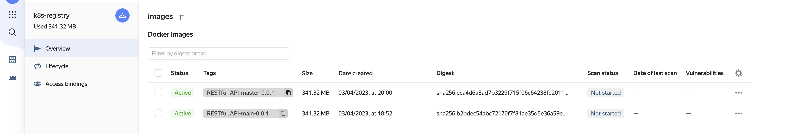

# Домашнее задание к занятию "12.Gitlab"

## Подготовка к выполнению

1. Необходимо [подготовить gitlab к работе по инструкции](https://cloud.yandex.ru/docs/tutorials/infrastructure-management/gitlab-containers)
2. Создайте свой новый проект
3. Создайте новый репозиторий в gitlab, наполните его [файлами](./repository)
4. Проект должен быть публичным, остальные настройки по желанию

## Основная часть

### DevOps

В репозитории содержится код проекта на python. Проект - RESTful API сервис. Ваша задача автоматизировать сборку образа с выполнением python-скрипта:
1. Образ собирается на основе [centos:7](https://hub.docker.com/_/centos?tab=tags&page=1&ordering=last_updated)
2. Python версии не ниже 3.7
3. Установлены зависимости: `flask` `flask-jsonpify` `flask-restful`
4. Создана директория `/python_api`
5. Скрипт из репозитория размещён в /python_api
6. Точка вызова: запуск скрипта
7. Если сборка происходит на ветке `master`: должен подняться pod kubernetes на основе образа `python-api`, иначе этот шаг нужно пропустить

### Ответ

Сборка автоматизирована, pipeeline сконфигурирован на ветках main и master.

<details>
<summary>Pipeline result</summary>

</details>

<details>
<summary>Build log main branch</summary>

</details>

<details>
<summary>Deploy log master branch</summary>

</details>
---

### Product Owner

Вашему проекту нужна бизнесовая доработка: необходимо поменять JSON ответа на вызов метода GET `/rest/api/get_info`, необходимо создать Issue в котором 
указать:
1. Какой метод необходимо исправить
2. Текст с `{ "message": "Already started" }` на `{ "message": "Running"}`
3. Issue поставить label: feature

### Ответ

Issue создан:

<details>
<summary>Issue screenshot</summary>

</details>

---

### Developer

Вам пришел новый Issue на доработку, вам необходимо:
1. Создать отдельную ветку, связанную с этим issue
2. Внести изменения по тексту из задания
3. Подготовить Merge Requst, влить необходимые изменения в `master`, проверить, что сборка прошла успешно

### Ответ

Создана ветка add-feature, она связана с Issue. Сборка образа происходит успешно после Merge request.

<details>
<summary>Docker registry with images</summary>

</details>

<details>
<summary>Deploy error</summary>

</details>

---

### Tester

Разработчики выполнили новый Issue, необходимо проверить валидность изменений:
1. Поднять докер-контейнер с образом `python-api:latest` и проверить возврат метода на корректность
2. Закрыть Issue с комментарием об успешности прохождения, указав желаемый результат и фактически достигнутый

### Ответ

```shell
20:04:17 | ~ []
\(vainoord) $> curl -X GET "localhost:5290/get_info"
{"version": 3, "method": "GET", "message": "Running"}
```

Issue закрыт:

<details>
<summary>Closed issue</summary>

</details>

---

## Итог

В качестве ответа предоставьте подробные скриншоты по каждому пункту задания:
- файл gitlab-ci.yml,
- Dockerfile,
- лог успешного выполнения пайплайна,
- решенный Issue.

### Ответ

[gitlab-ci.yml](https://gitlab.com/study-sg/gl-API/-/blob/master/.gitlab-ci.yml)\
[k8s.yaml](https://gitlab.com/study-sg/gl-API/-/blob/master/k8s.yaml)
[Dockerfile](https://gitlab.com/study-sg/gl-API/-/blob/master/Dockerfile)\
[Issue](https://gitlab.com/study-sg/gl-API/-/issues/1)\
Скриншоты логов ветки master (запуск pipeline выполнялся в gitlab инстанс yandex cloud):

<details>
<summary>Master branch build log</summary>

</details>

<details>
<summary>Master branch deploy log</summary>

</details>

---

### Важно 
После выполнения задания выключите и удалите все задействованные ресурсы в Yandex Cloud.

## Необязательная часть

Автомазируйте работу тестировщика — пусть у вас будет отдельный конвейер, который автоматически поднимает контейнер и выполняет проверку, например, при помощи curl. На основе вывода будет приниматься решение об успешности прохождения тестирования.

---

