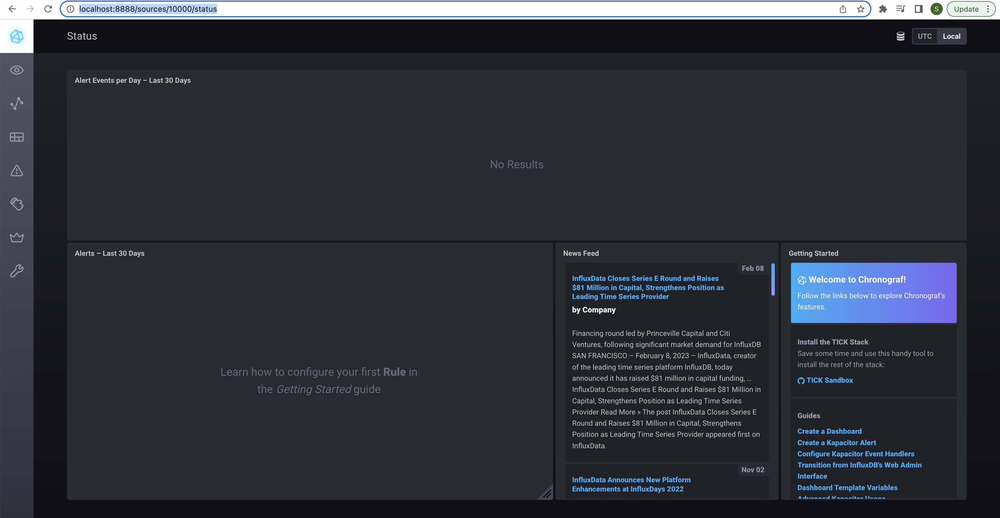
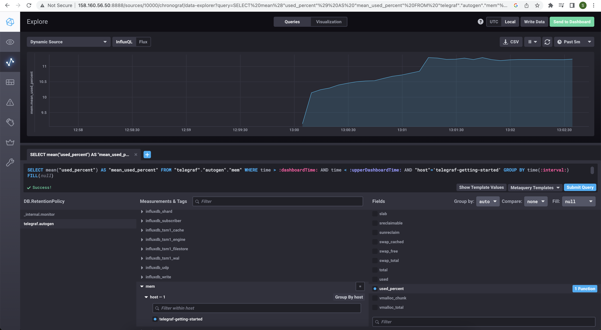
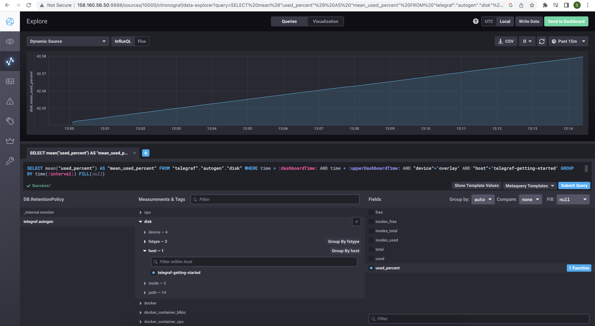
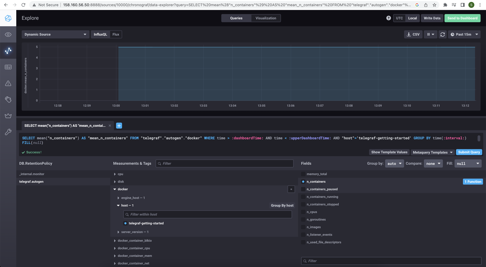
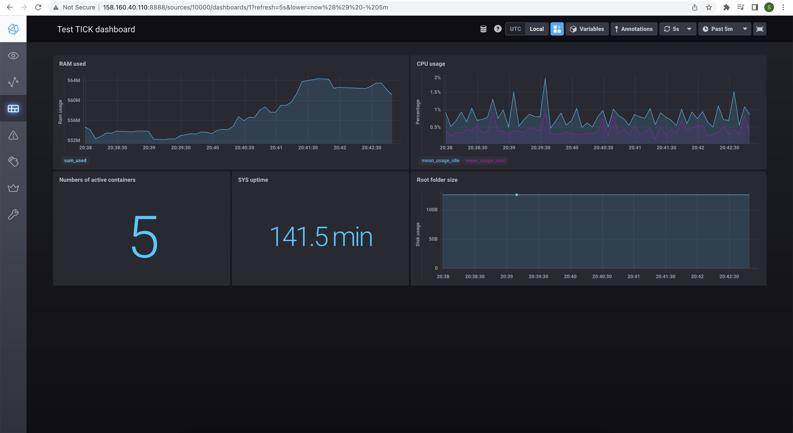

# Домашнее задание к занятию "13.Системы мониторинга"

## Обязательные задания

1. Вас пригласили настроить мониторинг на проект. На онбординге вам рассказали, что проект представляет из себя платформу для вычислений с выдачей текстовых отчетов, которые сохраняются на диск. Взаимодействие с платформой осуществляется по протоколу http. Также вам отметили, что вычисления загружают ЦПУ. Какой минимальный набор метрик вы выведите в мониторинг и почему?

### Ответ

Мониторинг в системе временных рядов:

- CPU LA: графики нагрузок вычислительных нод
- RAM/swap: графики использования ОЗУ в вычислительных нодах
- Inodes: слежение за переполнение индексных дескрипторов в нодах
- IOPS: мониторинг состояния дисков и рейд массивов в нодах
- FS: отслеживание свободного места на диске в системе
- NetTraffic: сбор данных о нагрузке сетевых интерфейсов нод

Мониторинг работоспособности ПО и бизнес логики:

- Общее количество HTTP запросов и процент корректных запросов (например с кодом 200)
- Общее количество запущенных процессов для вычислений в реальном времени
- Объем ОЗУ и памяти, выделяемый под процессы вычисления
- Количество выданных текстовых отчетов за единицу времени

#

2. Менеджер продукта посмотрев на ваши метрики сказал, что ему непонятно что такое RAM/inodes/CPUla. Также он сказал, что хочет понимать, насколько мы выполняем свои обязанности перед клиентами и какое качество обслуживания. Что вы можете ему предложить?

### Ответ

Чтобы удовлетворить потребности клиента, необходимо согласовать с ним уровень обслуживания (это попадет в метрику Service Level Agreement). Затем установить целевой уровень качества обслуживания (метрика Service Level Objectives), показатели которого выше уровня SLA и должны быть достижимы выделенными средствами. Клиент должен видеть фактический уровень качества обслуживания в реальном времени (метрика Service Level Indicators). SLA <= SLI < SLO.

Исходя из предыдущей задачи, необходимо показывать процент успешно выполненных HTTP запросов, процент успешно выданных текстовых отчетов и другие ключевые показатели из SLA. Также показывать процент выполнения SLA. Данные необходимо предоставлять за определенные промежутки времени: за час, прошедшие сутки, неделю, месяц, квартал и т.д.

#

3. Вашей DevOps команде в этом году не выделили финансирование на построение системы сбора логов. Разработчики в свою очередь хотят видеть все ошибки, которые выдают их приложения. Какое решение вы можете предпринять в этой ситуации, чтобы разработчики получали ошибки приложения?

### Ответ

Написать скрипт, который будет мониторить логи приложения, и в случае обнаружения, отправлять оповещение на электронную почту.

#

4. Вы, как опытный SRE, сделали мониторинг, куда вывели отображения выполнения SLA=99% по http кодам ответов. Вычисляете этот параметр по следующей формуле: summ_2xx_requests/summ_all_requests. Данный параметр не поднимается выше 70%, но при этом в вашей системе нет кодов ответа 5xx и 4xx. Где у вас ошибка?

### Ответ

Заданная формула охватывает только процент успешных ответов (2xx) от общего числа запросов, но есть также информационные ответы (1xx) и ответы перенаправления (3xx), которые не включают в себя ошибки. Поэтому формулу нужно поменять на следующую:\
`(summ_1xx_requests + sum_2xx_requests + summ_3xx_requests) / summ_all_requests`

#

5. Опишите основные плюсы и минусы pull и push систем мониторинга.

### Ответ

**Push model**:\
**+** Можно отправлять данные сразу на несколько серверов мониторинга, обеспечив репликацию сбора метрик\
**+** Что отправлять и с какой частотой настраивается на агенте отдельной ноды, гибкость настройки отправки\
**+** Отправка данных по протоколу UDP - увеличение производительности сбора метрик\

**-** На сервер могут приходит данные, не требуемые к мониторингу, т.е. нужен тонкий подход к настройке агентов
**-** UDP не гарантирует доставку пакета с данными, не шифруется и в UDP отсутствует аутентификация

**Pull model**:\
**+** Настройка сбора метрики и частота сбора идет на сервере, получение метрик идет по запросу сервера\
**+** Легче различать ошибки на стороне узла и сервера за счет работы протокола HTTP\
**+** Передача данных по протоколу TCP (HTTPS), контроль подлинности полученных данных, можно использовать proxy server с TLS\

**-** Затраты ресурсов на шифрование/разшифрование пакетов с метриками

#

6. Какие из ниже перечисленных систем относятся к push модели, а какие к pull? А может есть гибридные?

    - Prometheus 
    - TICK
    - Zabbix
    - VictoriaMetrics
    - Nagios

### Ответ

Prometheus - Pull model (Push опция c Pushgateway)\
TICK - Push model\
Zabbix - Push model (Pull опция с Zabbix Proxy)\
VictoriaMetrics - Push model по умолчанию (можно переключить на Pull)\
Nagios - Pull model

#

7. Склонируйте себе [репозиторий](https://github.com/influxdata/sandbox/tree/master) и запустите TICK-стэк, 
используя технологии docker и docker-compose.

В виде решения на это упражнение приведите выводы команд с вашего компьютера (виртуальной машины):

    - curl http://localhost:8086/ping
    - curl http://localhost:8888
    - curl http://localhost:9092/kapacitor/v1/ping

А также скриншот веб-интерфейса ПО chronograf (`http://localhost:8888`). 

P.S.: если при запуске некоторые контейнеры будут падать с ошибкой - проставьте им режим `Z`, например
`./data:/var/lib:Z`

### Ответ

```bash
18:00:14 | ~/tick/sandbox [master]
\(vainoord) $> curl http://localhost:8086/ping

```

```bash
18:00:38 | ~/tick/sandbox [master]
\(vainoord) $> curl http://localhost:8888
<!DOCTYPE html><html><head><link rel="stylesheet" href="/index.c708214f.css"><meta http-equiv="Content-type" content="text/html; charset=utf-8"><title>Chronograf</title><link rel="icon shortcut" href="/favicon.70d63073.ico"></head><body> <div id="react-root" data-basepath=""></div> <script type="module" src="/index.e81b88ee.js"></script><script src="/index.a6955a67.js" nomodule="" defer></script> </body></html>
```

```bash
18:00:49 | ~/tick/sandbox [master]
\(vainoord) $> curl http://localhost:9092/kapacitor/v1/ping

```

<details>
<summary>Chronograf screenshot</summary>

</details>

#

8. Перейдите в веб-интерфейс Chronograf (`http://localhost:8888`) и откройте вкладку `Data explorer`.

    - Нажмите на кнопку `Add a query`
    - Изучите вывод интерфейса и выберите БД `telegraf.autogen`
    - В `measurments` выберите mem->host->telegraf_container_id , а в `fields` выберите used_percent. 
    Внизу появится график утилизации оперативной памяти в контейнере telegraf.
    - Вверху вы можете увидеть запрос, аналогичный SQL-синтаксису. 
    Поэкспериментируйте с запросом, попробуйте изменить группировку и интервал наблюдений.

Для выполнения задания приведите скриншот с отображением метрик утилизации места на диске 
(disk->host->telegraf_container_id) из веб-интерфейса.

### Ответ

<details>
<summary>Mem Used percentage</summary>

</details>

<details>
<summary>Disk Used percentage</summary>

</details>

#

9. Изучите список [telegraf inputs](https://github.com/influxdata/telegraf/tree/master/plugins/inputs). 
Добавьте в конфигурацию telegraf следующий плагин - [docker](https://github.com/influxdata/telegraf/tree/master/plugins/inputs/docker):
```
[[inputs.docker]]
  endpoint = "unix:///var/run/docker.sock"
```

Дополнительно вам может потребоваться донастройка контейнера telegraf в `docker-compose.yml` дополнительного volume и 
режима privileged:
```
  telegraf:
    image: telegraf:1.4.0
    privileged: true
    volumes:
      - ./etc/telegraf.conf:/etc/telegraf/telegraf.conf:Z
      - /var/run/docker.sock:/var/run/docker.sock:Z
    links:
      - influxdb
    ports:
      - "8092:8092/udp"
      - "8094:8094"
      - "8125:8125/udp"
```

После настройке перезапустите telegraf, обновите веб интерфейс и приведите скриншотом список `measurments` в 
веб-интерфейсе базы telegraf.autogen . Там должны появиться метрики, связанные с docker.

Факультативно можете изучить какие метрики собирает telegraf после выполнения данного задания.

### Ответ

<details>
<summary>Docker measurements and fields</summary>

</details>

<details>
<summary>Dashboard</summary>

</details>

#

## Дополнительное задание (со звездочкой*) - необязательно к выполнению

1. Вы устроились на работу в стартап. На данный момент у вас нет возможности развернуть полноценную систему мониторинга, и вы решили самостоятельно написать простой python3-скрипт для сбора основных метрик сервера. Вы, как опытный системный-администратор, знаете, что системная информация сервера лежит в директории `/proc`. Также, вы знаете, что в системе Linux есть  планировщик задач cron, который может запускать задачи по расписанию.

Суммировав все, вы спроектировали приложение, которое:
- является python3 скриптом
- собирает метрики из папки `/proc`
- складывает метрики в файл 'YY-MM-DD-awesome-monitoring.log' в директорию /var/log 
(YY - год, MM - месяц, DD - день)
- каждый сбор метрик складывается в виде json-строки, в виде:
  + timestamp (временная метка, int, unixtimestamp)
  + metric_1 (метрика 1)
  + metric_2 (метрика 2)
  
     ...
     
  + metric_N (метрика N)
  
- сбор метрик происходит каждую 1 минуту по cron-расписанию

Для успешного выполнения задания нужно привести:

а) работающий код python3-скрипта,

б) конфигурацию cron-расписания,

в) пример верно сформированного 'YY-MM-DD-awesome-monitoring.log', имеющий не менее 5 записей,

P.S.: количество собираемых метрик должно быть не менее 4-х.
P.P.S.: по желанию можно себя не ограничивать только сбором метрик из `/proc`.

2. В веб-интерфейсе откройте вкладку `Dashboards`. Попробуйте создать свой dashboard с отображением:

    - утилизации ЦПУ
    - количества использованного RAM
    - утилизации пространства на дисках
    - количество поднятых контейнеров
    - аптайм
    - ...
    - фантазируйте)
    
    ---

### Как оформить ДЗ?

Выполненное домашнее задание пришлите ссылкой на .md-файл в вашем репозитории.

---

