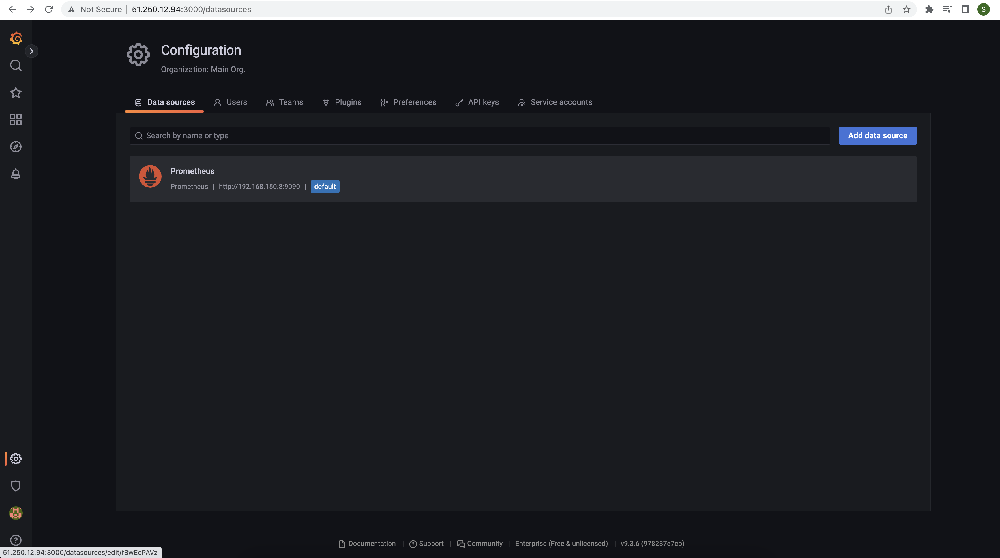
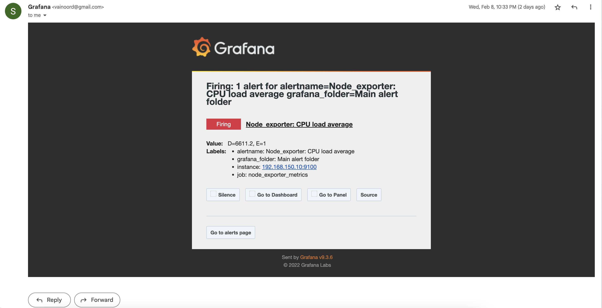
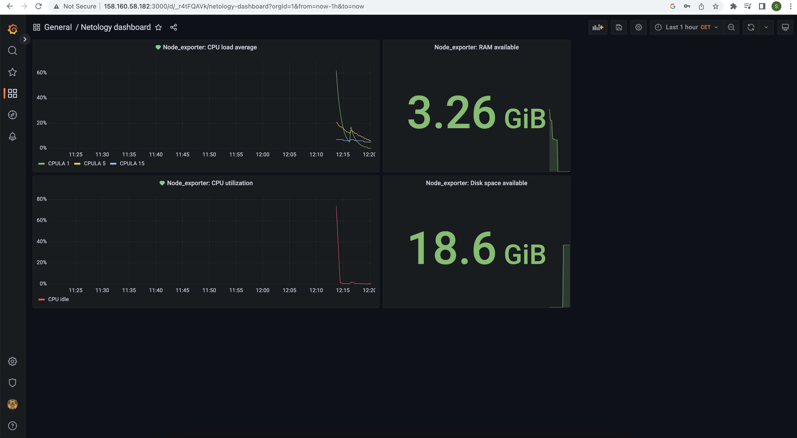

# Домашнее задание к занятию "14.Средство визуализации Grafana"

## Задание повышенной сложности

**В части задания 1** не используйте директорию [help](./help) для сборки проекта, самостоятельно разверните grafana, где в 
роли источника данных будет выступать prometheus, а сборщиком данных node-exporter:
- grafana
- prometheus-server
- prometheus node-exporter

За дополнительными материалами, вы можете обратиться в официальную документацию grafana и prometheus.

В решении к домашнему заданию приведите также все конфигурации/скрипты/манифесты, которые вы 
использовали в процессе решения задания.

**В части задания 3** вы должны самостоятельно завести удобный для вас канал нотификации, например Telegram или Email
и отправить туда тестовые события.

В решении приведите скриншоты тестовых событий из каналов нотификаций.

### Ответ

Prometheus server, node-exporter и grafana развернуты на vm в yandex cloud.\
[Конфигурация prometheus](./prometheus/prometheus.yml)

---

## Обязательные задания

### Задание 1
Используя директорию [help](./help) внутри данного домашнего задания - запустите связку prometheus-grafana.

Зайдите в веб-интерфейс графана, используя авторизационные данные, указанные в манифесте docker-compose.

Подключите поднятый вами prometheus как источник данных.

Решение домашнего задания - скриншот веб-интерфейса grafana со списком подключенных Datasource.

### Ответ

<details>
<summary> Grafana datasources screenshot </summary>

</details>

---

## Задание 2
Изучите самостоятельно ресурсы:
- [promql-for-humans](https://timber.io/blog/promql-for-humans/#cpu-usage-by-instance)
- [understanding prometheus cpu metrics](https://www.robustperception.io/understanding-machine-cpu-usage)

Создайте Dashboard и в ней создайте следующие Panels:
- Утилизация CPU для nodeexporter (в процентах, 100-idle)
- CPULA 1/5/15
- Количество свободной оперативной памяти
- Количество места на файловой системе

Для решения данного ДЗ приведите promql запросы для выдачи этих метрик, а также скриншот получившейся Dashboard.

### Ответ

Утилизация CPU для nodeexporter:\
`100 - (avg by(instance) (rate(node_cpu_seconds_total{job="node_exporter_metrics", mode="idle"}[1m])) * 100)`

CPULA 1/5/15:\
`node_load1{instance="192.168.150.10:9100", job="node_exporter_metrics"}`
`node_load5{instance="192.168.150.10:9100", job="node_exporter_metrics"}`
`node_load15{instance="192.168.150.10:9100", job="node_exporter_metrics"}`

Количество свободной оперативной памяти:\
`avg_over_time(node_memory_MemFree_bytes{instance="192.168.150.10:9100", job="node_exporter_metrics"}[10s])`

Количество места на файловой системе:\
`node_filesystem_avail_bytes{mountpoint="/", instance="192.168.150.10:9100", job="node_exporter_metrics"}`

---

## Задание 3
Создайте для каждой Dashboard подходящее правило alert (можно обратиться к первой лекции в блоке "Мониторинг").

Для решения ДЗ - приведите скриншот вашей итоговой Dashboard.

### Ответ

Выполнено:\
Включен smtp для передачи alerts на почту gmail.

<details>
<summary>SMTP grafana config</summary>

```
#################################### SMTP / Emailing ##########################
[smtp]
enabled = true
host = smtp.gmail.com:587
user = my.email@mail.provider
# If the password contains # or ; you have to wrap it with triple quotes. Ex """#password;"""
password = """#password;"""
;cert_file =
;key_file =
skip_verify = true
from_address = my.email@mail.provider
;from_name = Grafana
# EHLO identity in SMTP dialog (defaults to instance_name)
;ehlo_identity = dashboard.example.com
# SMTP startTLS policy (defaults to 'OpportunisticStartTLS')
;startTLS_policy = NoStartTLS
```

</details>

<details>
<summary> Test alert messages </summary>

</details>

<details>
<summary> Grafana Dashboard </summary>

</details>

---

## Задание 4
Сохраните ваш Dashboard.

Для этого перейдите в настройки Dashboard, выберите в боковом меню "JSON MODEL".

Далее скопируйте отображаемое json-содержимое в отдельный файл и сохраните его.

В решении задания - приведите листинг этого файла.

### Ответ

<details>
<summary> Grafana Dashboard JSON </summary>

```JSON
{
  "annotations": {
    "list": [
      {
        "builtIn": 1,
        "datasource": {
          "type": "grafana",
          "uid": "-- Grafana --"
        },
        "enable": true,
        "hide": true,
        "iconColor": "rgba(0, 211, 255, 1)",
        "name": "Annotations & Alerts",
        "target": {
          "limit": 100,
          "matchAny": false,
          "tags": [],
          "type": "dashboard"
        },
        "type": "dashboard"
      }
    ]
  },
  "editable": true,
  "fiscalYearStartMonth": 0,
  "graphTooltip": 0,
  "id": 1,
  "links": [],
  "liveNow": false,
  "panels": [
    {
      "datasource": {
        "type": "prometheus",
        "uid": "fBwEcPAVz"
      },
      "fieldConfig": {
        "defaults": {
          "color": {
            "mode": "palette-classic"
          },
          "custom": {
            "axisCenteredZero": false,
            "axisColorMode": "text",
            "axisLabel": "",
            "axisPlacement": "auto",
            "barAlignment": 0,
            "drawStyle": "line",
            "fillOpacity": 0,
            "gradientMode": "none",
            "hideFrom": {
              "legend": false,
              "tooltip": false,
              "viz": false
            },
            "lineInterpolation": "linear",
            "lineWidth": 1,
            "pointSize": 5,
            "scaleDistribution": {
              "type": "linear"
            },
            "showPoints": "auto",
            "spanNulls": false,
            "stacking": {
              "group": "A",
              "mode": "none"
            },
            "thresholdsStyle": {
              "mode": "off"
            }
          },
          "mappings": [],
          "thresholds": {
            "mode": "absolute",
            "steps": [
              {
                "color": "green",
                "value": null
              },
              {
                "color": "red",
                "value": 80
              }
            ]
          },
          "unit": "percentunit"
        },
        "overrides": []
      },
      "gridPos": {
        "h": 8,
        "w": 11,
        "x": 0,
        "y": 0
      },
      "id": 8,
      "options": {
        "legend": {
          "calcs": [],
          "displayMode": "list",
          "placement": "bottom",
          "showLegend": true
        },
        "timezone": [
          "browser"
        ],
        "tooltip": {
          "mode": "single",
          "sort": "none"
        }
      },
      "targets": [
        {
          "datasource": {
            "type": "prometheus",
            "uid": "fBwEcPAVz"
          },
          "editorMode": "code",
          "expr": "node_load1{instance=\"192.168.150.10:9100\", job=\"node_exporter_metrics\"}",
          "legendFormat": "CPULA 1",
          "range": true,
          "refId": "A"
        },
        {
          "datasource": {
            "type": "prometheus",
            "uid": "fBwEcPAVz"
          },
          "editorMode": "code",
          "expr": "node_load5{instance=\"192.168.150.10:9100\", job=\"node_exporter_metrics\"}",
          "hide": false,
          "legendFormat": "CPULA 5",
          "range": true,
          "refId": "B"
        },
        {
          "datasource": {
            "type": "prometheus",
            "uid": "fBwEcPAVz"
          },
          "editorMode": "code",
          "expr": "node_load15{instance=\"192.168.150.10:9100\", job=\"node_exporter_metrics\"}",
          "hide": false,
          "legendFormat": "CPULA 15",
          "range": true,
          "refId": "C"
        }
      ],
      "title": "Node_exporter: CPU load average",
      "type": "timeseries"
    },
    {
      "datasource": {
        "type": "prometheus",
        "uid": "fBwEcPAVz"
      },
      "fieldConfig": {
        "defaults": {
          "color": {
            "mode": "thresholds"
          },
          "mappings": [],
          "thresholds": {
            "mode": "absolute",
            "steps": [
              {
                "color": "green",
                "value": null
              }
            ]
          },
          "unit": "bytes"
        },
        "overrides": []
      },
      "gridPos": {
        "h": 8,
        "w": 6,
        "x": 11,
        "y": 0
      },
      "id": 4,
      "options": {
        "colorMode": "value",
        "graphMode": "area",
        "justifyMode": "auto",
        "orientation": "auto",
        "reduceOptions": {
          "calcs": [
            "lastNotNull"
          ],
          "fields": "",
          "values": false
        },
        "textMode": "auto"
      },
      "pluginVersion": "9.3.6",
      "targets": [
        {
          "datasource": {
            "type": "prometheus",
            "uid": "fBwEcPAVz"
          },
          "editorMode": "code",
          "expr": "avg_over_time(node_memory_MemFree_bytes{instance=\"192.168.150.10:9100\", job=\"node_exporter_metrics\"}[10s])",
          "legendFormat": "RAM available",
          "range": true,
          "refId": "A"
        }
      ],
      "title": "Node_exporter: RAM available",
      "type": "stat"
    },
    {
      "datasource": {
        "type": "prometheus",
        "uid": "fBwEcPAVz"
      },
      "fieldConfig": {
        "defaults": {
          "color": {
            "mode": "continuous-RdYlGr"
          },
          "custom": {
            "axisCenteredZero": false,
            "axisColorMode": "text",
            "axisLabel": "",
            "axisPlacement": "auto",
            "barAlignment": 0,
            "drawStyle": "line",
            "fillOpacity": 0,
            "gradientMode": "none",
            "hideFrom": {
              "legend": false,
              "tooltip": false,
              "viz": false
            },
            "lineInterpolation": "linear",
            "lineWidth": 1,
            "pointSize": 5,
            "scaleDistribution": {
              "type": "linear"
            },
            "showPoints": "auto",
            "spanNulls": false,
            "stacking": {
              "group": "A",
              "mode": "none"
            },
            "thresholdsStyle": {
              "mode": "off"
            }
          },
          "mappings": [],
          "thresholds": {
            "mode": "absolute",
            "steps": [
              {
                "color": "green",
                "value": null
              },
              {
                "color": "red",
                "value": 80
              }
            ]
          },
          "unit": "percent"
        },
        "overrides": []
      },
      "gridPos": {
        "h": 8,
        "w": 11,
        "x": 0,
        "y": 8
      },
      "id": 2,
      "options": {
        "legend": {
          "calcs": [],
          "displayMode": "list",
          "placement": "bottom",
          "showLegend": true
        },
        "tooltip": {
          "mode": "single",
          "sort": "none"
        }
      },
      "targets": [
        {
          "datasource": {
            "type": "prometheus",
            "uid": "fBwEcPAVz"
          },
          "editorMode": "code",
          "expr": "100 - (avg by(instance) (rate(node_cpu_seconds_total{job=\"node_exporter_metrics\", mode=\"idle\"}[1m])) * 100)",
          "hide": false,
          "legendFormat": "CPU idle",
          "range": true,
          "refId": "A"
        }
      ],
      "title": "Node_exporter: CPU utilization",
      "type": "timeseries"
    },
    {
      "datasource": {
        "type": "prometheus",
        "uid": "fBwEcPAVz"
      },
      "fieldConfig": {
        "defaults": {
          "color": {
            "mode": "palette-classic"
          },
          "mappings": [],
          "thresholds": {
            "mode": "absolute",
            "steps": [
              {
                "color": "green",
                "value": null
              },
              {
                "color": "red",
                "value": 80
              }
            ]
          },
          "unit": "bytes"
        },
        "overrides": []
      },
      "gridPos": {
        "h": 8,
        "w": 6,
        "x": 11,
        "y": 8
      },
      "id": 6,
      "options": {
        "colorMode": "value",
        "graphMode": "area",
        "justifyMode": "auto",
        "orientation": "auto",
        "reduceOptions": {
          "calcs": [
            "lastNotNull"
          ],
          "fields": "",
          "values": false
        },
        "textMode": "auto"
      },
      "pluginVersion": "9.3.6",
      "targets": [
        {
          "datasource": {
            "type": "prometheus",
            "uid": "fBwEcPAVz"
          },
          "editorMode": "code",
          "expr": "node_filesystem_avail_bytes{mountpoint=\"/\", instance=\"192.168.150.10:9100\", job=\"node_exporter_metrics\"}",
          "legendFormat": "Disk space available",
          "range": true,
          "refId": "A"
        }
      ],
      "title": "Node_exporter: Disk space available",
      "type": "stat"
    }
  ],
  "refresh": "5s",
  "schemaVersion": 37,
  "style": "dark",
  "tags": [],
  "templating": {
    "list": []
  },
  "time": {
    "from": "now-1h",
    "to": "now"
  },
  "timepicker": {},
  "timezone": "",
  "title": "Netology dashboard",
  "uid": "_r4tFQAVk",
  "version": 20,
  "weekStart": ""
}
```
</details>

---

### Как оформить ДЗ?

Выполненное домашнее задание пришлите ссылкой на .md-файл в вашем репозитории.

---